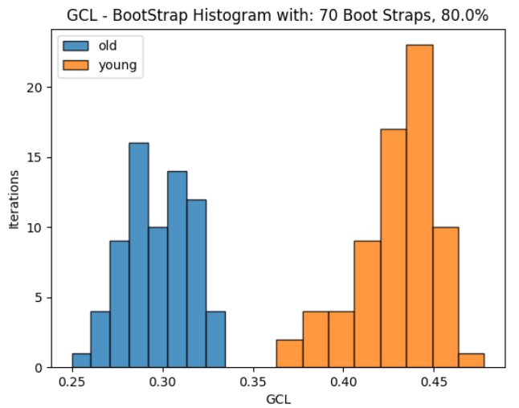
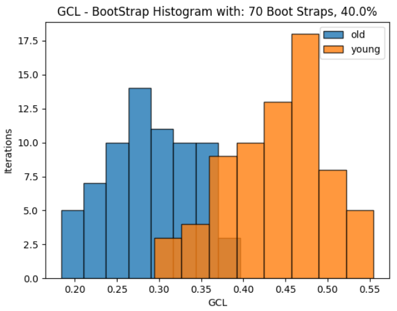

# GCL_Tool_BIU

Calculate the GCL of the input data with jackknife

# Requirements:

1) Python 3 and above (3.9.1 is recommended).
2) Packages for python: (if you don't have one of the following, right click inside python on the missing import -> Show
   Context Actions -> Install Package):  numpy, math, random, scipy, threading. for the example you will also need:
   matplotlib, sys, pathlib, os.

# How to include the tool in your own python project:

1) Put the gcl_library.py file inside your python project.
2) Add the import: import gcl_library as gcl_lib
3) For example adding a jackknife command to get a vector, simply write: gcl_lib.jackknife(the required arguments)

# An example using the gcl_example.py file :

 Expect the process to run around 1 minute in this example, make sure all libraries are installed.

Download all the files from this github reposatory to a floder on your computer. 
A) Run the program with the following arguments (use space as delimiter):

1) data_arr [mandatory] - files array data with all the files in the current folder to make the GCL on.
2) jackknife [optional - default:70] - Number of jackknives iterations for calculation.
3) jackknife_percentage [optional - default:0.8] - Percentage of cells to choose for jackknife realization, a number between 0 and 1.
4) task_option [optional -default:'jackknife'] - either 'jackknife' or 'regular_calc' for the requested task.
5) num_division [optional - default:10] - Number of random gene division iterations for each calculation.

Example set of arguments:

* old.csv,young.csv 70 0.8 jackknife 10
* old.csv,young.csv 70 0.4 jackknife 10
   
  This two examples will yield the following:
   

* for default values - enter 'default' instead of the requested value. An input for example: old.csv,young.csv default 0.8 jackknife 10
